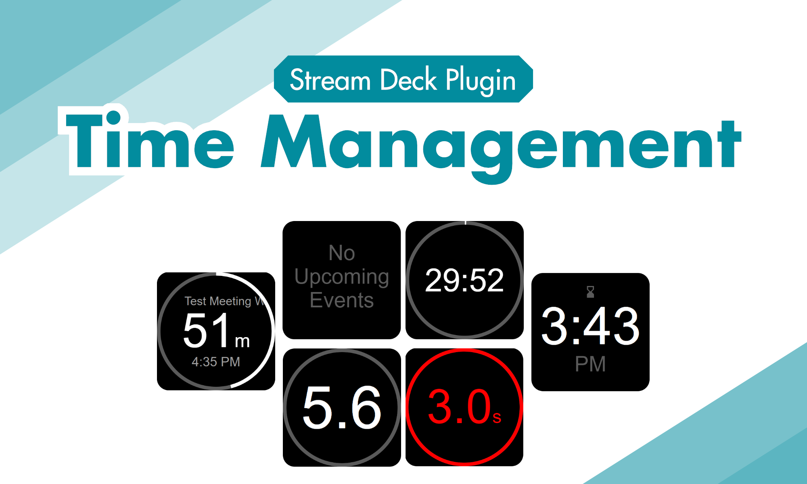

# Stream Deck Time Management Plugin

A plugin for the Elgato Stream Deck for managing time.

Includes a calendar action that shows upcoming events and a clock/timer action



## Calendar Action

Connects to a public iCal address and downloads the events that are coming up (or happening). A "private" calendar can be used by getting a "private" link. Google Calendar and others support this method.

Once you enter the calendar URL, the plugin automatically gets the latest events every ~5 minutes.

* When an event is coming soon, it shows a countdown & blinks red when the event is about to start.
* When the event is happening, it counts down to the end of the meeting.
* After the meeting, it will countdown to the start of the next meeting.
* Long pressing the event will open up the video link in a browser (if a virtual meeting) or open up a link to Google Maps if there's a location attached to the event.

## Clock Action

Shows the current time by default.
* A single click will start a countdown timer (or stopwatch).
* To switch between countdown mode and stopwatch mode, double click.
* Click the timer to pause or resume;
* To reset the timer, long press.


## How it works

This plugin uses Svelte under the hood to generate SVGs based on the current state of the plugin/action. It then watches for any changes and emits the current SVG to the Stream Deck SDK. The SVG is then shown on the Stream Deck key's display.

There are some limitations to the SVGs that are allowed. It took a decent amount of trial and error to find that not all properties work. It's best to stick to the most basic SVG properties.

## Development

Install npm, and run the following:
```
npm i
npm run dev
```

This will open up locahost:5173 where the actions can be viewed and tested.

It uses Svelte & Vite under the hood for automatic HMR.

To build the code run,

```
npm run build
```

The output will be in the dist folder. This can be packaged into a `.sdPlugin` file and put in the StreamDeck plugins folder

```
WINDOWS: %appdata%\Elgato\StreamDeck\Plugins\
MAC:   ~/Library/Application Support/com.elgato.StreamDeck/Plugins/
```

For more information, read the [Stream Deck Plugin documentation](https://developer.elgato.com/documentation/stream-deck/sdk/create-your-own-plugin/)

## Debugging

To debug, open the browser url:

```
http://localhost:23654/
```

Click on the plugin name and a chrome remote session will start. This allows you to see what the actual StreamDeck is running.
